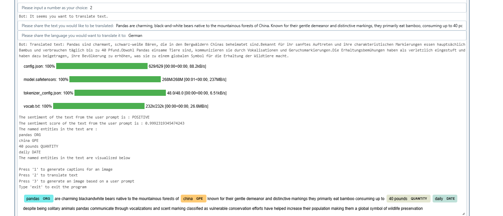

### Gen AI Hackathon Solution

**Teammate:** Rahul Shrestha

### Dependencies:

### Output of solution:
1. **Generating captions based on an input image**

2. **Text translation to a target language**

3. **Generating an image based on a user input**
