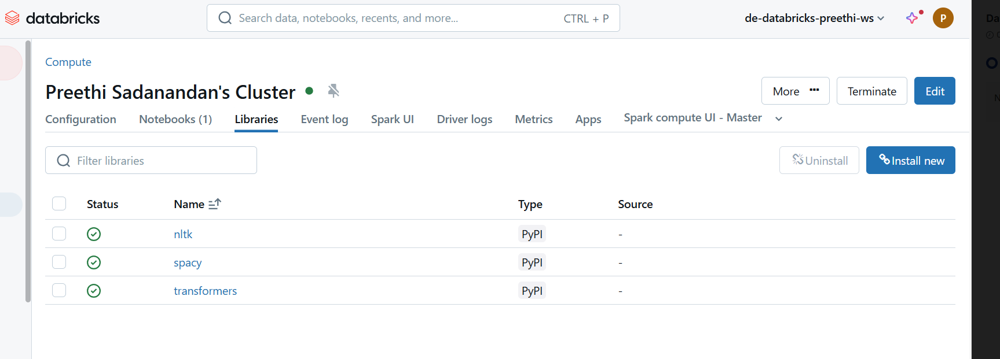

### Assignment for week 1: A simple python program to find all noun chunks in a sentence (with Spacy or NLTK)

### Solution: Uses spacy package.

#### Dependencies required for this script:
- Databricks version: 14.3LTS ML
- Packages: nltk, spacy, transformers

