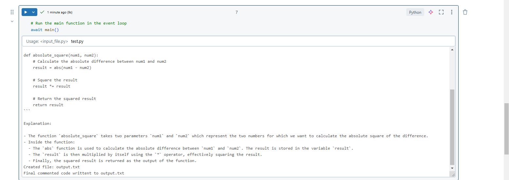

### Assignment for Week 2: Build a model which can generate code with comments based on your prompt. 

### How it use:
1. Updated Cell 2 in the notebook with the code you would like documented. 
2. Update the Azure configuration settings. 
3. Run all cells (works in Databricks)
4. Requires input of the input file name. Eg: `test.py`

### Solution: 

### Dependencies:
